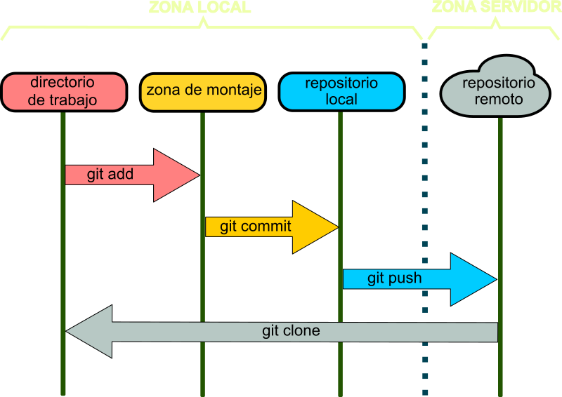

# Flujo de trabajo con Git

## Conceptos clave.

**Repositorio.**

Un repositorio Git es un directorio que contiene todos los archivos y la historia de cambios de un proyecto. Puede ser local en tu computadora o remoto en un servidor.

**Commit.**

En Git, un commit es una instantánea de los cambios en los archivos en el repositorio en un momento dado. Cada commit tiene un mensaje que describe los cambios realizados.

**Clonar (Clone).** 

Clonar un repositorio Git significa crear una copia completa del repositorio en tu máquina local. Esto te permite trabajar en el proyecto de manera independiente.

**.gitignore**

El archivo .gitignore es un archivo especial utilizado en proyectos gestionados por Git para especificar los archivos y directorios que Git debe ignorar, es decir, que no deben ser rastreados ni incluidos en el control de versiones. Esto es útil cuando tienes archivos generados automáticamente, archivos temporales, archivos de construcción o archivos sensibles que no deseas que se incluyan en el repositorio Git.

El archivo .gitignore contiene reglas de patrones de nombres de archivos o directorios que le dicen a Git qué archivos y carpetas deben omitirse al realizar operaciones como git add, git commit, git status, etc.

**Branch (Rama).**

Es una línea de desarrollo independiente. Puedes crear ramas para trabajar en nuevas características o solucionar problemas sin afectar la rama principal (generalmente llamada "master" o "main").

**Merge (Combinar).**

El acto de combinar dos ramas en Git se llama "merge". Puedes fusionar los cambios de una rama en otra para incorporar nuevas características o correcciones de errores.

**Pull (Tirar).** 

En Git, "pull" significa traer los cambios desde un repositorio remoto a tu repositorio local. Es útil para mantener tu copia local actualizada con los cambios realizados por otros colaboradores.

**Push (Empujar).** 

"Push" en Git se refiere a enviar los cambios que has realizado en tu repositorio local a un repositorio remoto. Esto comparte tus cambios con otros colaboradores.

**Pull Request (Solicitud de extracción).** 

En Git, una solicitud de extracción es una forma de proponer cambios en una rama y solicitar que se fusionen en otra rama (a menudo la rama principal). Es comúnmente utilizado en plataformas como GitHub para la colaboración en proyectos de código abierto.
